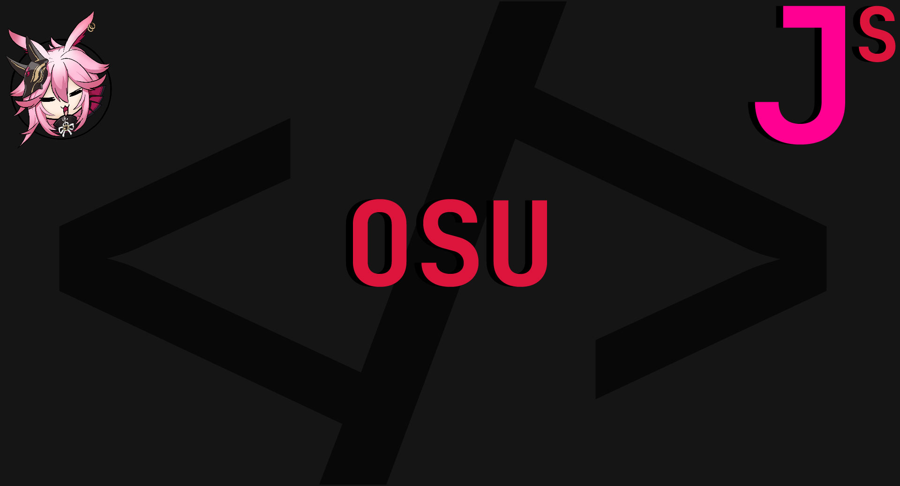

    
    
    <h3 align="center"> 💠 Osu 💠 </h3>
    
 osu! info module
        <strong><a href="../../example.js#L151"> Click Here to see code usage </a></strong>
         
        <a href="https://kura.gq"><strong> Visit the creator » </strong></a>
    

    

        <a href="https://discord.gg/H5PwwSJ"> Contact </a>
        •
        <a href="https://github.com/DPulavarthy/Jonin-Services/issues"> Report Bug </a>
        •
        <a href="https://github.com/DPulavarthy/Jonin-Services/issues"> Request Feature </a>
    

